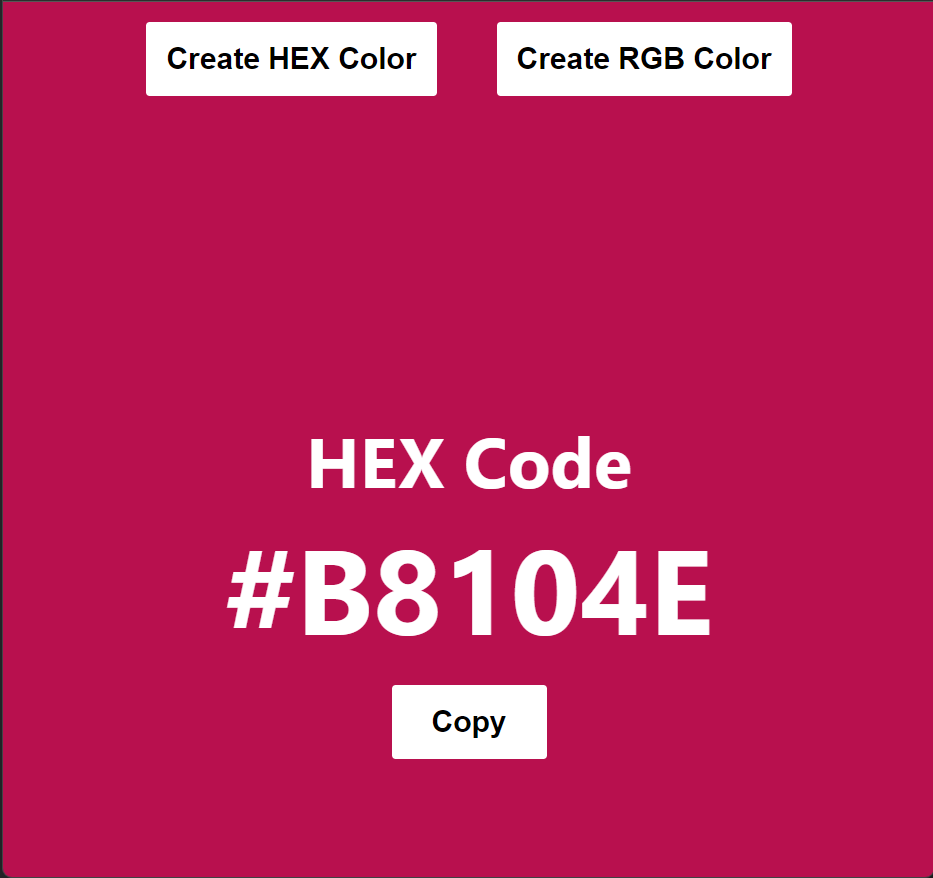
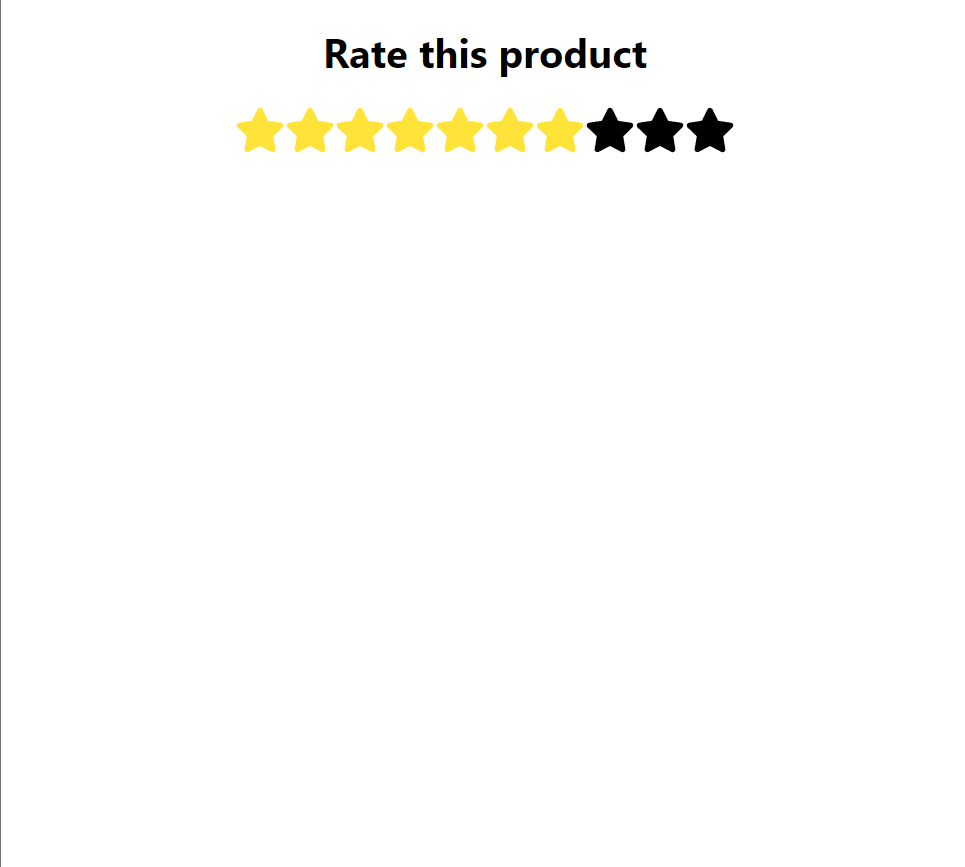
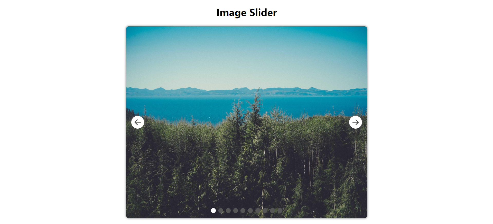

# Free Code Camp Projects

## [Build 25 React Projects](https://www.youtube.com/watch?v=5ZdHfJVAY-s)

### Project I - Accordion

- Implement single selection and multi selection accordion for a web page.
- Data created using FAQs from [Vihn Giang's Stage Academy](https://stageacademy.mykajabi.com/)

- Multi Selection Accordion Design

  

### Project II - Random Color Generator

- Work on the project to generate random HEX and RGB color codes.
- Random Color Generator Design

  

### Project III - Star Rating

- Implement star rating using the icon from [react-icons](https://www.npmjs.com/package/react-icons)
- Star Rating Design

  

### Project IV - Image Slider

- Implement image sliding using images from a [Picsum API](https://picsum.photos/v2/list?page=2&limit=10)
- Image Slider Design

  
